# Lab 4 Dataflow Gen2

---

## Task 1: Create Dataflow Gen2 — SalesPerson

1. Go to your workspace and click **+ New Item**.

2. In the search box, type **Dataflow** to find **Dataflow Gen2**.

   

3. Name the Dataflow:

   `Dataflow_SalesPerson_{your student number}`

   Click **Create**.

   

4. Click **Get data from another source**.

   

5. Choose **Azure SQL Database**.

   

6. Enter the following connection details:
   - **Server:** `fiad-sqlserver01.database.windows.net`
   - **Database:** `wwi-sample-sqldb`
   - **Connection:** Select the connection used earlier — FIAD wwi-sample-sqldb

   

7. Select table **Application.People** and click **Create**.

   

8. Click the header row for the field **IsSalesperson** and then click
   the **Filter** button from the menu.

   We want to keep rows where **IsSalesperson = TRUE**.

   

9. Next we want to cleanse the data and take only a subselection of
   the fields. Click **Choose Columns**.

   Click **Select All** to deselect all the automatically selected
   fields and then click to add:
   - `PersonID`
   - `FullName`
   - `PreferredName`

   Click **Ok**.

   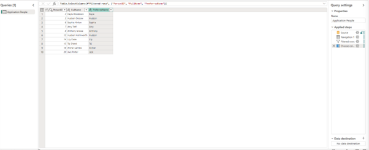

10. Save the Dataflow.

11. At the bottom right, next to **Data destination** click **+** and
    select **Lakehouse**.

12. Under **Advanced Options** change **Navigate using Full hierarchy
    (enables schema support)** to **True**.

    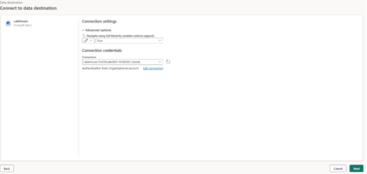

13. Select the Lakehouse you created earlier and click **Next**.

14. For destination target, open the Lakehouse and highlight the
    **Sales** schema. In **Name** type `DimSalesPerson` and click **Next**.

    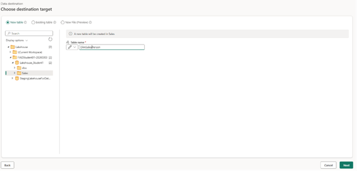

15. Click **Save Settings**.

16. Run the Dataflow.

    > It takes a little time to propagate the change so it is visible
    > in the Lakehouse, initially showing as files and delta log etc.

17. Go to the Lakehouse and review the tables.

    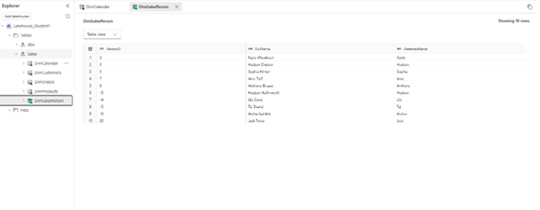

---

## Task 2: Add Territory Query to Dataflow Gen2

In this task you will add a second query to the same Dataflow Gen2 to bring territory
data into your Lakehouse. The source table `Application.StateProvinces` contains US
state and sales territory information that enriches your data model with geographic context.

1. In the same Dataflow Gen2, right-click in the **Queries** pane and select **New query**.

   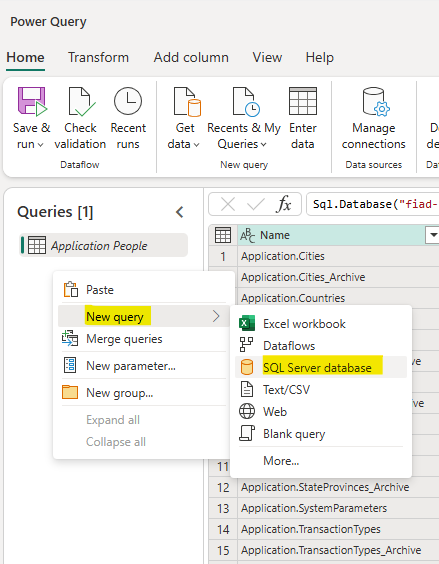

2. Click **Get data from another source**.

   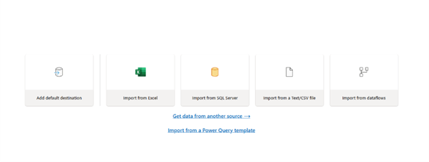

4. Select the existing connection — **FIAD wwi-sample-sqldb** — and click **Next**.

   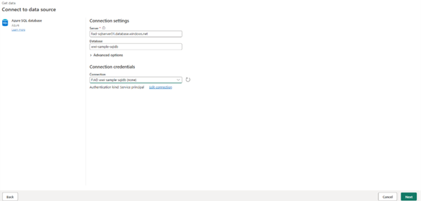

5. Select table **Application.StateProvinces** and click **Create**.

   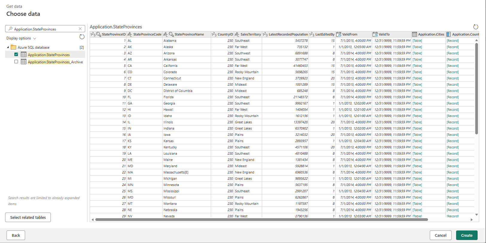

6. We only need a subset of the available columns. Click **Choose Columns**.

   Click **Select All** to deselect all fields and then select:
   - `StateProvinceID`
   - `StateProvinceCode`
   - `StateProvinceName`
   - `SalesTerritory`

   Click **Ok**.

   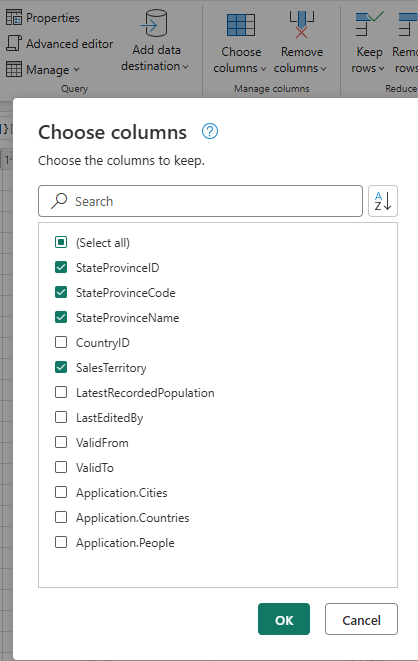

7. Save the Dataflow.

8. At the bottom right, next to **Data destination** click **+** and select **Lakehouse**.

   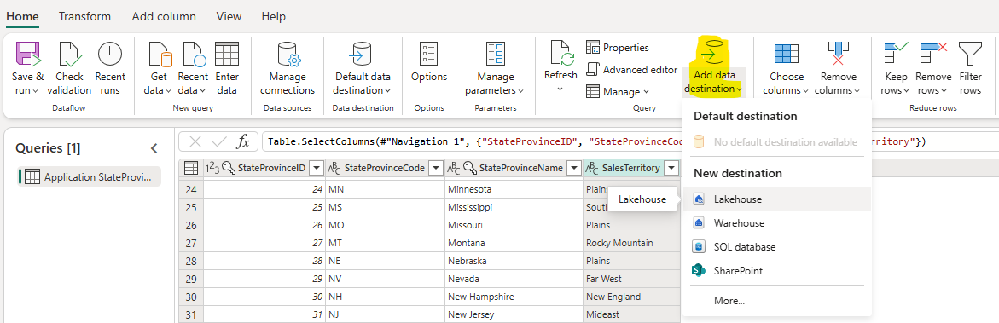

9. Under **Advanced Options** change **Navigate using Full hierarchy
   (enables schema support)** to **True**.

   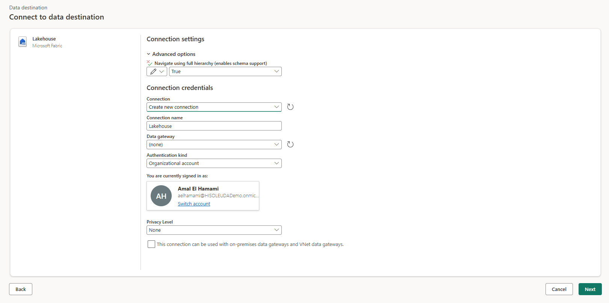

10. Select the Sales schema and click Next.

    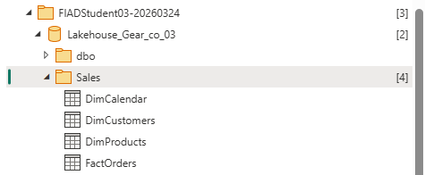

11. For destination target, open the Lakehouse and highlight the **Sales** schema.
    In **Name** type `DimTerritory` and click **Next**.

    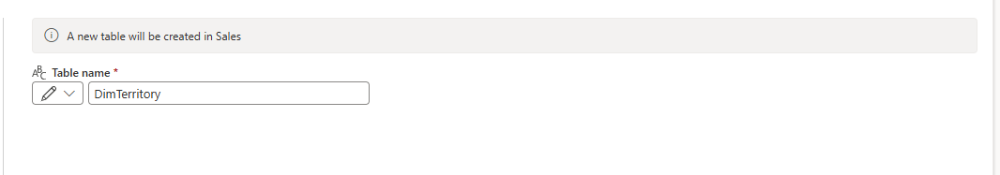

12. Review the column mapping and click **Save Settings**.

    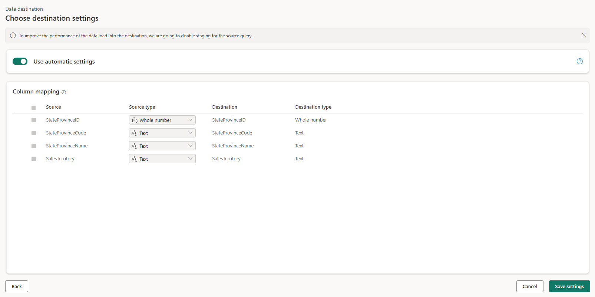

13. Run the Dataflow.

    > It takes a little time to propagate the change so it is visible
    > in the Lakehouse, initially showing as files and delta log etc.

14. Go to the Lakehouse and review the tables. You should now see
    **DimTerritory** in your Tables section with 53 rows containing
    US state and territory data.

    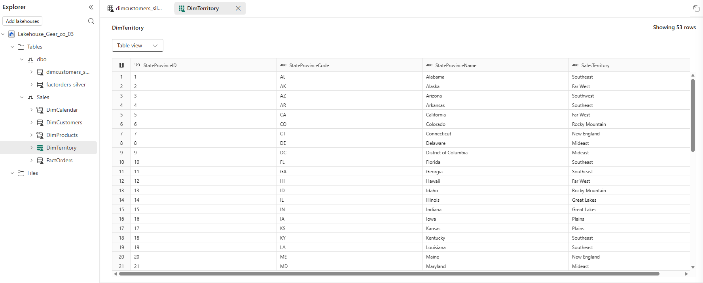

---

[Previous: Lab 3 — Data Modelling, Reporting & Visualization](03-reporting.md) | [Next: Lab 5 — Pipeline](05-pipeline.md)

