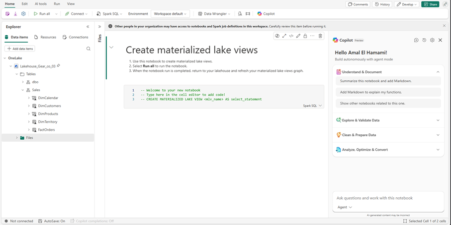
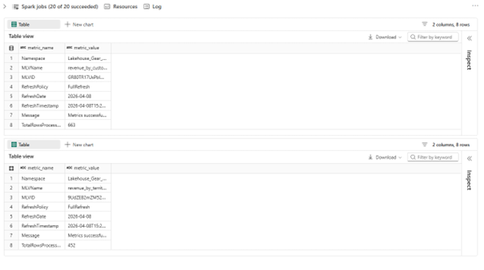
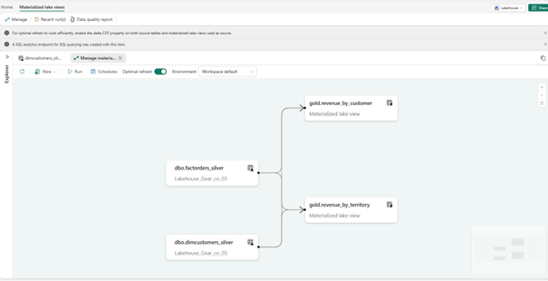
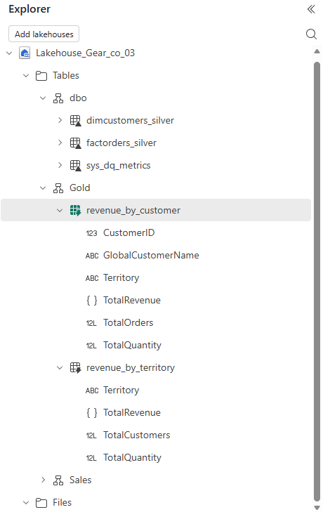
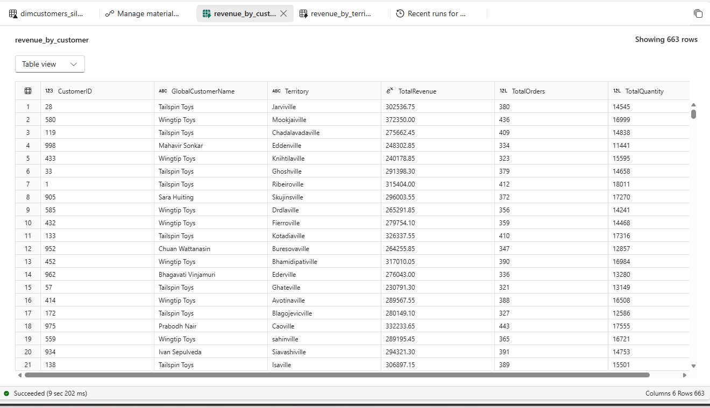
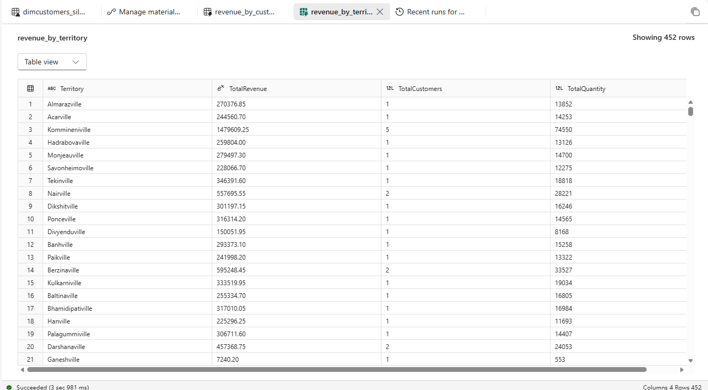

# Lab 6: Materialized Lake Views

Materialized Lake Views (MLVs) are a feature in Microsoft Fabric that
allows you to define pre-computed, reusable transformations on top of
your Lakehouse tables. Unlike regular views, MLVs store the results
physically and can be refreshed automatically on a schedule.

In this lab you will:
- Create MLVs on top of the silver tables built in Lab 2
- Schedule automatic refresh
- Explore the lineage graph

---

## Context

So far in this training, your data follows this flow:

| Layer | Tables |
|---|---|
| Bronze (raw) | FactOrders, DimCustomers |
| Silver (cleaned) | factorders_silver, dimcustomers_silver |
| Gold (aggregated) | MLV: Revenue by customer, MLV: Revenue by territory |

Materialized Lake Views sit in the **Gold** layer. They are
pre-computed aggregations that Power BI and analysts can query
directly without re-running transformations every time.

---

## Prerequisites

- Lab 1, 2 and 3 completed
- `factorders_silver` and `dimcustomers_silver` tables exist in
  your Lakehouse

---

## Task 1: Create a Notebook for MLVs

1. Go to your Lakehouse and click the **Materialized lake views** tab.

2. Click **New** then **New notebook** then **Create with Spark SQL**.

   Alternatively click **Open notebook** from the main canvas.

    

   A new notebook opens with a template to create a materialized
   lake view.

3. Rename the notebook to `Gear_co_MLV`.


4. Before creating the MLVs, enable **Change Data Feed** on the
   source tables. This allows Fabric to use incremental refresh
   instead of reprocessing all data on every run.

   In the first cell, paste the following and click **Run**:

```sql
ALTER TABLE dbo.factorders_silver
SET TBLPROPERTIES (delta.enableChangeDataFeed = true);

ALTER TABLE dbo.dimcustomers_silver
SET TBLPROPERTIES (delta.enableChangeDataFeed = true);
```


---

## Task 2: Create the MLVs

1. Click **+ Code** to add a new cell below.

2. Paste the following SQL to create a Gold schema and two
   Materialized Lake Views:

```sql
CREATE SCHEMA IF NOT EXISTS Gold;

-- MLV 1: Revenue by customer
CREATE MATERIALIZED LAKE VIEW IF NOT EXISTS
Gold.revenue_by_customer AS
SELECT
   c.CustomerID,
   c.GlobalCustomerName,
   c.Territory,
   SUM(o.TotalAmount) AS TotalRevenue,
   COUNT(o.OrderID) AS TotalOrders,
   SUM(o.Quantity) AS TotalQuantity
FROM dbo.factorders_silver o
JOIN dbo.dimcustomers_silver c
ON o.CustomerID = c.CustomerID
GROUP BY
   c.CustomerID,
   c.GlobalCustomerName,
   c.Territory;

-- MLV 2: Revenue by territory
CREATE MATERIALIZED LAKE VIEW IF NOT EXISTS
Gold.revenue_by_territory AS
SELECT
   c.Territory,
   SUM(o.TotalAmount) AS TotalRevenue,
   COUNT(DISTINCT o.CustomerID) AS TotalCustomers,
   SUM(o.Quantity) AS TotalQuantity
FROM dbo.factorders_silver o
JOIN dbo.dimcustomers_silver c
ON o.CustomerID = c.CustomerID
GROUP BY
   c.Territory;
```

3. Click **Run all** to execute all cells in the notebook.



4. Once completed, go back to your Lakehouse and click
   **Materialized lake views**.

5. Click the **Refresh** icon to see the newly created MLVs appear
   in the lineage graph.



    
   You should see:
   - `factorders_silver` and `dimcustomers_silver` feeding into `Gold.revenue_by_customer`
   - `Gold.revenue_by_customer` feeding into `Gold.revenue_by_territory`

---

## Task 3: Verify the Results

1. In the Lakehouse Explorer, expand the **Gold** schema.



2. Click on **revenue_by_customer** to preview the data.

   

3. Click on **revenue_by_territory** to preview the data.

   

---

## Key Concepts

| Concept | Description |
|---|---|
| Materialized Lake View | A pre-computed view stored physically in the Lakehouse |
| Change Data Feed | Enables incremental refresh — only processes new/changed rows |
| Lineage graph | Shows the dependency chain between source tables and MLVs |
| Optimal refresh | Fabric automatically decides between incremental or full refresh |
| Gold layer | Final aggregated layer ready for reporting and analysis |

---

[Previous: Lab 5 — Pipeline](05-pipeline.md)
